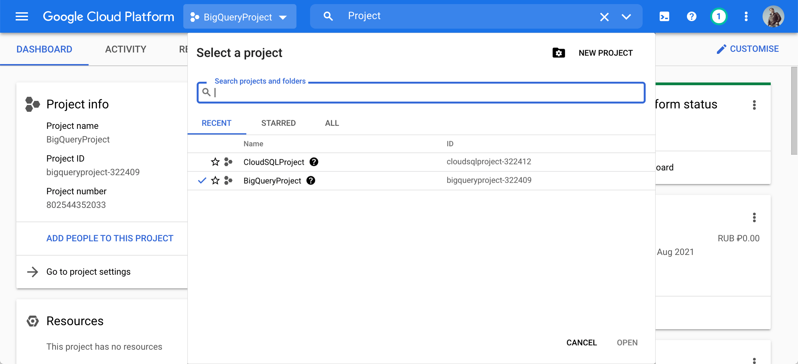
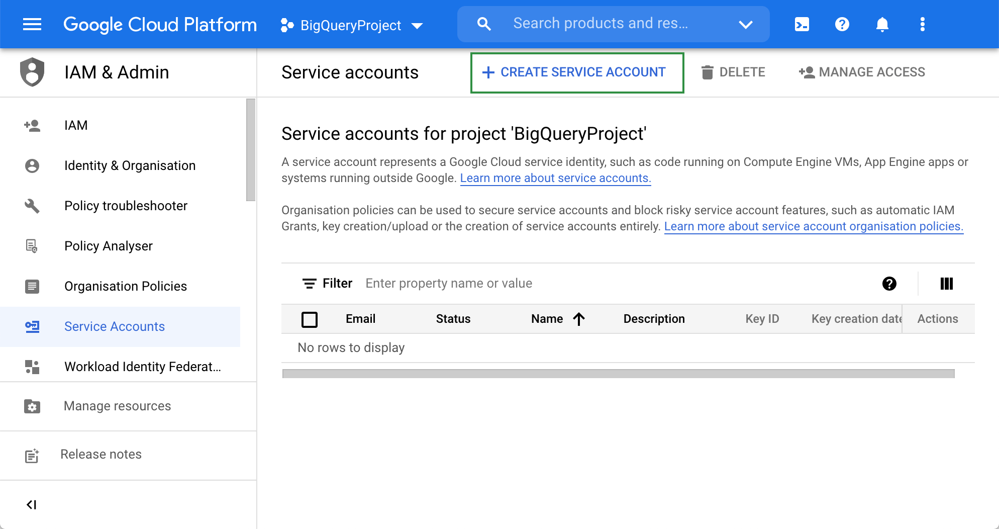
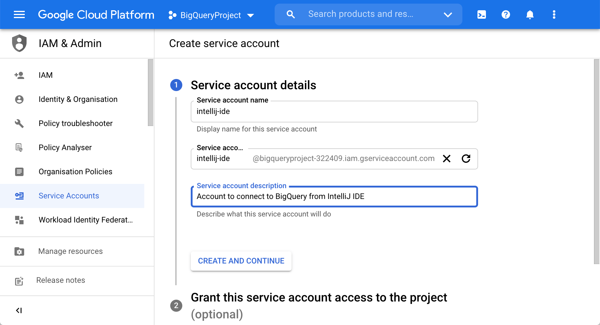
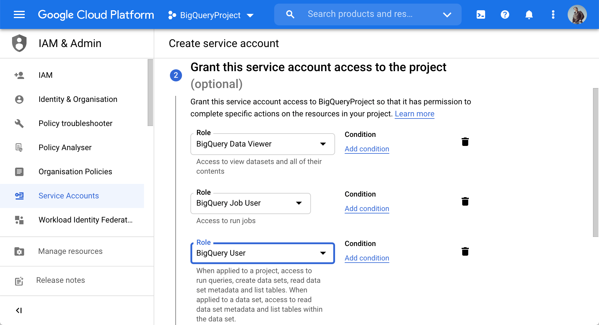
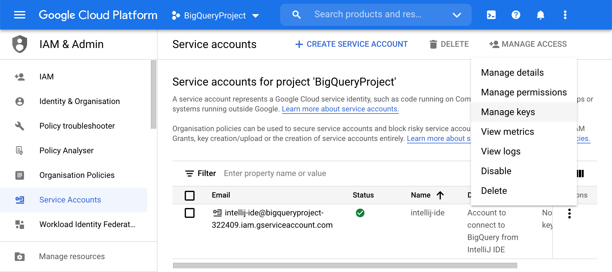
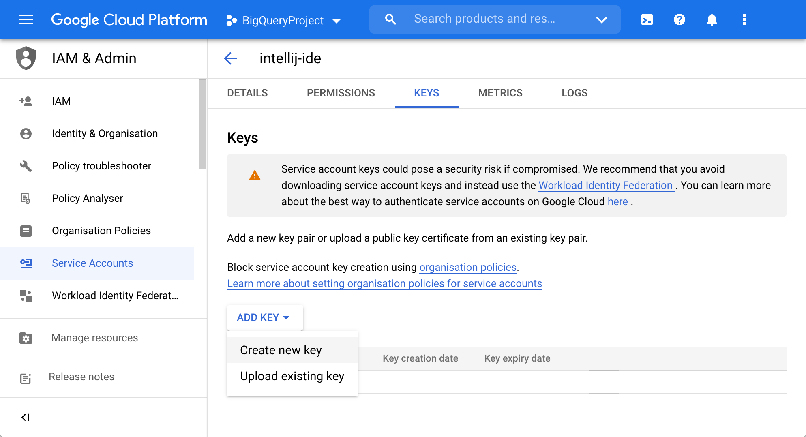
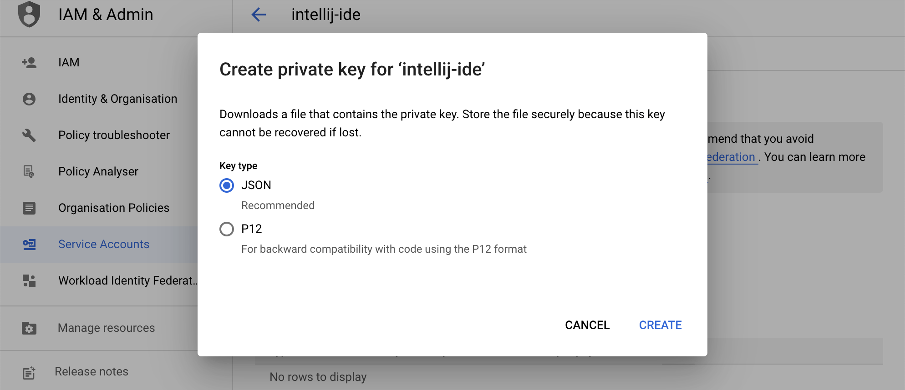

# Google BigQuery for PHP

### Configurando o projeto Google Cloud

> #### Etapa 1. Crie ou selecione um projeto
>
> * Para criar um projeto, selecione IAM & Admin | Crie um projeto no menu de navegação do Google Cloud Platform. Como alternativa, clique na lista Criar um projeto na página Painel e clique em Novo projeto.
>
>
> * Para selecionar um projeto existente, clique em um projeto que deseja usar na lista Selecionar um projeto na página Painel.
> ```sh
> NOTA: O BigQuery é ativado automaticamente em novos projetos. Para ativar o BigQuery em um projeto preexistente, 
> clique em Ativar a [API do BigQuery](https://console.cloud.google.com/flows/enableapi?apiid=bigquery).
> ```
> 

Em seguida, você precisa criar uma conta de serviço que será usada por seu aplicativo. Para obter mais informações sobre contas de serviço, consulte Contas de serviço em [cloud.google.com](https://cloud.google.com/iam/docs/service-accounts).

> #### Etapa 2. Crie uma conta de serviço
>
> * No menu de navegação do Google Cloud Platform, selecione IAM e Admin | Contas de serviço.
>
>
> * Na página Contas de serviço , clique em Criar conta de serviço.
>
> 
>
>
>
> * Na etapa Detalhes da conta de serviço no assistente, digite um nome de projeto e uma descrição.
>
> 
>
>
> * Na etapa Conceder acesso a esta conta de serviço ao projeto no assistente, selecione papéis para esta conta de serviço.
>
> Por exemplo, para acesso somente leitura, selecione BigQuery Data Viewer , BigQuery Job User e BigQuery User no menu BigQuery.
> Como alternativa, selecione BigQuery | Administrador do BigQuery para acesso a todos os recursos do projeto. Para obter mais informações sobre funções e permissões, consulte [Funções e permissões predefinidas em cloud.google.com.](https://cloud.google.com/bigquery/docs/access-control)
>
> 


#
### Conectando-se ao BigQuery com uma conta de serviço do Google

> #### Gerando chaves de conta de serviço
>
> * Na página Contas de serviço ( IAM e Admin | Contas de serviço ), clique no ícone de configuração na coluna Ações e selecione Gerenciar chaves.
>
> 
>
> * Clique na lista Adicionar chave e selecione Criar nova chave.
>
> 
>
> * Na caixa de diálogo Criar chave privada , selecione JSON e clique em Criar.
>
> 
>
>
> O download da chave privada é iniciado automaticamente.

### Leitura

1. DataGrip [official documentation](https://www.jetbrains.com/help/datagrip/connect-to-bigquery.html).
2. [USING BIGQUERY AND DATA STUDIO WITH GOOGLE ANALYTICS 4](https://ken-williams.com/guide/reporting-analysis/using-bigquery-and-data-studio-with-google-analytics-4/)
2. [Consultar com a API BigQuery](https://cloud.google.com/bigquery/docs/samples/bigquery-simple-app-all?hl=pt-br#bigquery_simple_app_all-php)
2. [Github Google Cloud](https://github.com/googleapis/google-cloud-php/tree/master/BigQuery)
2. [Github Google Cloud Doc](https://github.com/googleapis/google-cloud-php/blob/master/AUTHENTICATION.md)
2. [Exportar dados do Firebase Crashlytics para o BigQuery](https://firebase.google.com/docs/crashlytics/bigquery-export?hl=pt)
2. [Esquema Crashlytics BigQuery Export](https://support.google.com/firebase/answer/9036484?hl=en)
   .
